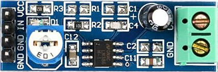
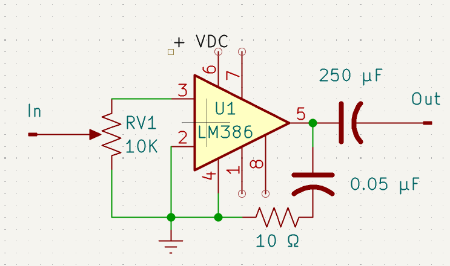

# PICO-6502

This is a 6502 emulator for the [Raspberry Pi Pico](https://www.raspberrypi.org/products/raspberry-pi-pico/)

This is a fork of the follow repo:

https://github.com/jfoucher/pico-6502

This is a fork of the emulator that runs on a Raspberry Pi Pico, with additional hardware. The hardware is as follows:

* SD Card Reader - To store binary files, that can be run, and other support files.
* RS232 Interface - To connect a USB serial cable
* I/O Expansion board - To be used to emulate the 6522 chip.
* Reset button - Reset the unit without having to unplug the USB cable
* LCD display - For displaying information.

## Compiling for Linux and Mac (Didn't try it on Windows)

* You need the Pi Pico SDK and CMake installed before you start.

* Create a directory called build

    mkdir -p build

* Run CMake

    cmake ..

* Run Make

    make

* Copy the uf2 file to the Pi Pico

## Features

### Configuration File

The file contains the configuration for the device. You can set some things to Auto. If the file does not exist, the defaults
are used:

#### ROM-FILE=roms.txt (Default roms.txt)

#### SERIAL-FLOW=0

Serial Flow Control. Values are:

* 0 = Auto (Default)
* 1 = None
* 2 = RTS/CTS
* 3 = XON/XOFF

#### LCD-INSTALLED=1

LCD Installed

* 0 = No (Default)
* 1 = Yes

#### IO-EMULATION=0

I/O Emulation
* 0 = Auto
* 1 = None
* 2 = VIA Full (Pico GPIO)
* 3 = I/O Only (Pico GPIO)
* 4 = VIA Full (Expansion Board)
* 5 = I/O Only (Expansion Board)

#### I/O Pins if Pico GPIO for VIA

Specify whether the pin is a VIA pin or not for the Pi Pico. Values are:
* VIA - VIA I/O pin
* RESERVED - Pin is used by something else

The VIA pins start with PA0, going up to PA7. The next pin is PB0, going up to 
PB7. If there is more VIA pins specified than actual pins, they are ignored. If
you don't have 16 VIA pins, the rest are not assigned to a pin on the Pi Pico.

    GPIO-0=RESERVED  * Serial RX
    GPIO-1=RESERVED  * Serial TX
    * --             * GND
    GPIO-2=RESERVED  * Serial CTS
    GPIO-3=RESERVED  * Serial RTS
    GPIO-4=RESERVED  * SD Card MISO
    GPIO-5=RESERVED  * SD Card CS
    * --             * GND
    GPIO-6=RESERVED  * SD Card SCLK
    GPIO-7=RESERVED  * SD Card MOSI
    GPIO-8=VIA       * PA0
    GPIO-9=VIA       * PA1
    * --             * GND
    GPIO-10=VIA      * PA2
    GPIO-11=VIA      * PA3
    GPIO-12=VIA      * PA4
    GPIO-13=VIA      * PA5
    * --             * GND
    GPIO-14=VIA      * PA6
    GPIO-15=VIA      * PA7
    *-------------------------------
    GPIO-16=VIA      * PB0
    GPIO-17=VIA      * PB1
    * --             * GND
    GPIO-18=VIA      * PB2
    GPIO-19=VIA      * PB3
    GPIO-20=VIA      * PB4
    GPIO-21=VIA      * PB5
    * --             * GND
    GPIO-22=VIA      * PB6
    * --             * RUN
    GPIO-26=VIA      * PB7
    GPIO-27=RESERVED * Unused
    * --             * GND
    GPIO-28=RESERVED * Unused
    * --             * VREF
    * --             * 3V3
    * --             * EN
    * --             * GND
    * --             * VSYS
    * --             * VBUS

#### Mapping characters

You can map characters between 1 and 255 to characters sequences, such as Unicode characters or ANSI character sequences.

For each mapping add an entry with a key beginning with "OUT_MAP_" followed by the ASCII value of the key to map. If you put
a '$' before the ASCII value, it will be interpreted as a hexidecimal number. This is then followed by an equal sign.

Example: Mapping the 160 in hex would be OUT_MAP_$A0=, or in decimal OUT_MAP_160=.

You can specify 3 different sequences:

##### Comma delimited sequences

This is a sequence of decimal or hex values for the sequence. If you put a '$' in front of
the number, it will be treated as a hex number. An example is above.

##### Unicode character

This is the unicode value which will be translated to a UTF-8 sequences. To specify it, put a U as
the first character.

Examples:
* OUT_MAP_200=UE0F0 will map the unicode E0F0 to the decimal character 200 decimal.
* OUT_MAP_$C8=UE0F0 will map the unicode E0F0 TO the hex character C8, which is 200 decimal.

An example of mapping the characters to Unicode for the Commodore characters set is in the config.txt in the SD card image. 
You need to use the C64 Pro Mono font, in your terminal, to see the font.

##### ANSI escape sequence

If you put '^' as the first character it will translate it as an ANSI escape sequence. The '^'
is translated as the escape character.

Example:

    OUT_MAP_$1C=^[31m

This will map the forground color red to hex ASCII character 1C.

If you put '|' (pipe characters) in a ANSI sequence, this will be treated as a parameter in the ANSI sequence. For each
pipe character, the character following the ANSI sequence will be used to fill the parameter.

Example:

If you have the sequence:

    ^[|;|H

and the two character following the sequence is:

    10 and 20

The sequence will be sent out as:

    ^[10;20H

#### Alternate Output Mappings

You can specify an alternate maps by the following;

OUT_MAP_\<mapped character\>:\<mapping set\>=\<mapping\>

Examples:

* OUT_MAP_$0A:$01=UE0F0
* OUT_MAP_$0A:1=UE0F0
* OUT_MAP_160:1=UE0F0
* OUT_MAP_160:$01=UE0F0

If you what to map the main one, leave off the mapping set, specify 0.

To select the alternate mapping 1, in MS-BASIC, run the following:

PRINT CHR$(0);CHR$(1)

If you want to use the main set, run the following:

PRINT CHR$(0);CHR$(0)

You only need to map the characters that already exist in the main set. If you do not map it in the alternate set, it will use the one in the main set.

Currently, you can not have alternates for input mappings.

#### Configuration Directives

You can have directives in you configuration file. These are parsed before the actual reading 
of configuration file. This get the file ready to read.

The directives are as follows:

* !DEFINE(key,value) - Defines a key/value pair that can be used for conditional or substitutions. If you invoke the key with
a different value, the value will be replaced, with the new value.
* !INCLUDE(filename) - Includes another file into the current file, at this place.
* !IFDEF(key) - If the key is defined, the block between this directive and the !ELSE or !ENDIF will be included in the file.
* !IFNDEF(key) - If the key is not defined, the block between this directive and the !ELSE or !ENDIF will be included in the file.
* !IFEQ(key,value) - If the key is equal to the value, the block between this directive and the !ELSE or !ENDIF will be included in the file.
* !IFNE(key,value) - If the key is not equal to the value, the block between this directive and the !ELSE or !ENDIF will be included in the file.
* !ELSE - The text between this directive and the !ENDIF will be included, if the if condition is false.
* !ENDIF - Terminates the if condition. Must have an equal number of if condition, to match the endif.

You can nest if conditions.

You can substitute values in the define, into the text. You can do this by putting the following in the text:

    ${key-to-define}

key-to-define - The key to a !DEFINE that you did earlier. If a value is not defined, an empty string is substituted.

Example:

If you did the following in early in the code:

    !DEFINE(abc,substitution)

And you did the following text

    This is ${abc} text.

The output would be:

    This is substitution text.

### Loading ROMs from SD Card

I added the SD Card to allow you to load the ROMs from the card, instead loading them using header files. Originally, the 
the emulator loaded the Taliforth ROM from a header file. I have converted it to a .bin file, and also included other 
binary files, that can be loaded. This allows you to develop 6502 code and run it, without recompiling the emulator.
The emulator looks for a roms.txt file, which includes the description, bin file, starting location, VIA location, and I/O location

Included are binary files for the following:

* TaliForth
* WOZMon (Modified for the Pico-6502)
* MSBasic (Modified and extended for the Pico-6502) https://github.com/sean-johnston/msbasic
* Hello World program
* Echo (Echos keystrokes from the terminal)

### Sound 

You can connect an audio amplifier and speaker to GPIO pin 28 to get a tone. To play the note, put the value in location
$F008 (low byte) and $F009 (High byte). The value is 65536 - microseconds for a pulse.

Example: A (440) is	63264 or 32 (LB) and 247 (HB)

### Extended I/O

I extended the I/O to allow saving and loading to the SD Card, as well as displaying a directory. The following are the default I/O
addresses. The start of theses addresses can be overridden in the roms.txt file. The protocol for the extra I/O will be explained
later in this document. The addresses are as follows:

* $F001 - Character Out - Send a character to the terminal
* $F002 - File Mode - Set the type of operation to perform
* $F003 - File Data - This is used to stream the data out, based on the File Mode
* $F004 - Character In - Get a character from the terminal
* $F005 - File Load Data - This is used to stream the data in, based on the File Mode 
* $F006 - Debug IO Enable - This enables debugging output for the I/O.
* $F007 - LCD status. If 1, the LCD is installed. If 0, it is not. This is read from the configuration file.
* $F008 - Low byte of frequency for sound (65536 - microsecond)
* $f009 - High byte of frequency for sound (65536 - microsecond)

### RS232 interface

A serial RS232 interface can be connected UART0. You can connect one with or without flow
control. GPIO pin 0 connects to RX. GPIO pin 1 connects to TX. GPIO pin 2 connects to CTS
(optional RTS/CTS flow control). If you do not have CTS, you can use XON/XOFF, by
grounding GPIO pin 2. If the pin is grounded, to will detect XON/XOFF. If it is not
it will assume RTS/CTS flow control. 

### I/O Expansion

The original code used the Pico GPIO pins for the VIA emulation. Since the SD card was
added, we ran out of pins for the VIA emulation.

The I/O expansion connect through the I2C interface 0. It is address 0x27. It response
to the VIA addresses (Default $D000). The ports are as follows:

$D000 Port B data
$D001 Port A data
$D002 Port B data direction
$D003 Port A data direction

The rest of the other registers have not been implemented yet, but will be in the future.

You can add move I/O expansion modules to the I2C bus. You just need to make a different
address, and implement it in the code.

### LCD Display

The LCD display is connected I/O expansion, on Port B. This the same port that is used in
the Ben Eater Breadboard 6502. It uses the exact same code, except for the change of the
memory address.

## Extended I/O Protocol

### File Mode

Then interacting with the extended I/O You need to set the file mode. This determines what 
is sent or received from the data ports, and what the format is. The modes are as follows:

#### $00 - Idle

Resets all extended I/O and frees any memory associated with it. This can be used to put 
the system into a known state.

#### $FF - Send Filename

Send the data to $F003. This starts with a byte that is the length of the filename, followed
by the file name.

* byte 0 - Length of filename
* byte 1 - First byte
* ...
* byte n - nth byte

#### $FE - Send File Data

Send a block of data. 

Send the data to $F003. This starts with the high byte of length, and then the low byte of
the length. The number of bytes follows.

* byte 0 - High byte of length of data
* byte 1 - Low byte of length of data
* byte 2 - First byte
* ...
* byte n - nth byte

#### $FD - End Data

Save the data, and go back to idle state.

This take the data and sends it the data to the SD card, based on the filename specified. If
no filename is specified, or the file already exists, this will fail. An error code is
returned in $F003. If it is not 0, there is an error.

Error codes are as follows:

* 0 Success
* 1 Could not open file
* 4 No filename specified
* 5 Could not mount file system
* 6 File exists

#### $FC - Read File Data

Load the data from the specified filename or catalog.

Read the data from $F005. This starts with the high byte of length, and then 
the low byte of the length. The number of bytes follow.  If no filename is 
specified, or the file does not exist, this will fail. An error code is 
returned in $F003. If it is not 0, there is an error.

* byte 0 - High byte of length of data
* byte 1 - Low byte of length of data
* byte 2 - First byte
* ...
* byte n - nth byte

Error codes are as follows:

* 0 Success
* 1 Could not open file
* 4 No filename specified
* 5 Could not mount file system

#### $FB - Read Catalog From SD Card

Load a catalog of the SD card. 

Read the data from $F005. This starts with the high byte of length, 
and then the low byte of the length. The number of bytes follows.

* byte 0 - High byte of length of data
* byte 1 - Low byte of length of data
* byte 2 - First byte
* ...
* byte n - nth byte

Error codes are as follows:

* 5 Could not mount file system

#### $FA - Delete File From SD Card

Delete the specified file from the SD card

* 0 Success
* 4 No filename specified
* 5 Could not mount file system
* 6 File exists

### Module Used In The Project

The following modules are used in the project. I will list what they are, 
and give an Amazon link to the ports. You can substitute other modules, 
but you may need to modify the code or wiring.

#### Pi Pico

You can use any of the Pi Picos. (Pico, Pico W, Pico 2, Pico 2 W, Pico 2 H)

#### Pi Pico Breakout Board (Optional)

Freenove Breakout Board for Raspberry Pi Pico 1 2 W H WH, Terminal Block 
Shield HAT with Pin Header, GPIO Status LED

https://www.amazon.com/dp/B0BFB53Y2N?ref=ppx_yo2ov_dt_b_fed_asin_title

This a a breakout board that I used to allow connecting the Dupont jumper
wires to the different modules.

#### RS232 Interface

NOYITO TTL to RS232 Module TTL RS232 Male Female Mutual Conversion Module 
Serial Level Conversion to SP232 TTL Serial Port Communicates with RS232 
Level Device 15KV ESD Protect (Female)

http://amazon.com/dp/B07BJJC3R6?ref=ppx_yo2ov_dt_b_fed_asin_title&th=1

This is an interface to connect a RS232 cable to the Pi Pico on UART0. The one that I am
using, has the flow control pins. You can connect the USB serial cable directly to the 
pins if you don't want to do the RS232. You can even just use the Pico USB serial.

#### SD Card Module

HiLetgo 5pcs Micro SD TF Card Adater Reader Module 6Pin SPI Interface Driver Module with chip Level Conversion for Arduino UNO R3 MEGA 2560 Due

https://www.amazon.com/dp/B07BJ2P6X6?ref=ppx_yo2ov_dt_b_fed_asin_title

#### I/O Expansion Module

Waveshare MCP23017 IO Expansion Board I2C Interface Expands 16 I/O Pins Compatible with Both 3.3V and 5V Levels

https://www.amazon.com/dp/B07P2H1NZG?ref=ppx_yo2ov_dt_b_fed_asin_title

#### 1602A LCD Module

2 Pack HD44780 1602 LCD Display Module DC 5V 16x2 Character Blue Blacklight
Visit the LGDehome Store

https://www.amazon.com/dp/B079M3GWFG

#### 10K Trimmer Pot

Any potentiometer will do, as long as it is 10K. This is for the contrast
control on the LCD. If you are not using the LCD, you don't need to get
the potentiometer.

DGZZI 10k Trim Potentiometer 8PCS Breadboard Trim Potentiometer with Knob 
for Arduino Raspberry Pi 3386MP-103 3Pins 0-10K Ohm

https://www.amazon.com/dp/B07ZYVS2W6?ref=ppx_yo2ov_dt_b_fed_asin_title

#### Jumper Wires

Any kind of wires will do, depending on how you are hooking them up.

#### Audio Amplifier and Speaker

To do sound, we need an amplifier and speaker.

If you want to but one completely assembled, you can get this on Amazon:

WWZMDiB LM386 Mono Audio Amplifier 200 Times Circuit Design with 10K Adjustable Resistor 5~12V

https://www.amazon.com/dp/B0CCJ5G8YR?ref=ppx_yo2ov_dt_b_fed_asin_title

If you want to build the amp yourself, here is a schematic:

 
Speaker can bought on Amazon here:

2 Pack 2" 8ohm 3w Full Range Speakers, DIY Speaker Kit for Replacement Speakers, Complicable with Arduino Speaker

https://www.amazon.com/dp/B0DYDT1KTW?ref=ppx_yo2ov_dt_b_fed_asin_title&th=1

## Wiring Diagram

Below is the wire diagram for my unit. I also have one that only has the Pi
Pico, RS232 interface, and SD card. In this repo I also included the 3D 
models to attach the module with 1mm x 3 mm screws.

## Computer Unit

Here is a picture of the computer unit with the modules attached to the 
3D printed sub-straight.

You can interact with it via its USB serial connection.
